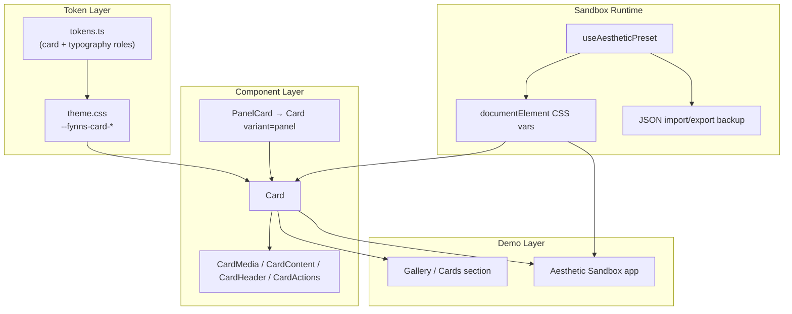

# M3 卡片复刻 + 交互式审美沙盒

## 目标与约束（来自你的选择）


| 维度        | 决策                                                                                                        |
| --------- | --------------------------------------------------------------------------------------------------------- |
| 范围        | 复刻 [M3 Cards guidelines](https://m3.material.io/components/cards/guidelines) 上的全部 variant + layout + 交互状态 |
| PanelCard | 并入 `Card variant="panel"`，保留现有 API 作为薄包装                                                                  |
| Elevation | **不在代码里定死**；三种 M3 形态都实现，由沙盒实时切换对比                                                                         |
| 沙盒位置      | Gallery 展示成品 + 独立 `examples/aesthetic-sandbox`                                                            |
| 导出        | 运行时 CSS 变量覆盖 + **JSON 备份**（import/export），不写回 `tokens.ts`                                                 |
| 避免        | 大写宽字距标题、纯边框无层次、重 ripple、Fluent/大厂分割、过大圆角/气泡留白、渐变玻璃拟态                                                      |
| 保留        | 现有 inline icon 系列不变                                                                                       |


**默认 variant 推荐：`filled`**

- M3 规范默认形态；比 `outlined` 少「纯边框平板感」，比 `elevated` 少「阴影 AI 卡片感」
- 沙盒定稿后可改 global default，且沙盒 chrome 同步响应

---

## 架构总览




核心原则：**沙盒的控制面板本身**（侧边栏、分组 Card、Slider、Toggle）全部用 `@fynns/ui`  primitive 构建，并读取同一套 `--fynns-card-*` / `--fynns-typography-mode` 变量——调参即「所见即所得」。

---

## 第一步：Card 组件族（设计系统层）

### 1.1 新增 token 组（`[src/theme/tokens.ts](src/theme/tokens.ts)` → `npm run gen:theme`）

在 `tokens.ts` 增加 `**card`** 与 `**typography-role**`（M3 角色名映射到 fynns 字号/字重）：

```ts
// 示意 — 具体初值可在实现时按 M3 spec 换算
card: {
  "radius": "12px",           // M3 corner medium 起点，沙盒可调
  "padding": "16px",
  "padding-compact": "12px",
  "margin": "8px",            // M3 推荐 mobile margin
  "elevation-default": "0",   // filled/outlined
  "elevation-elevated": "1",  // 映射到 shadow token 或 brightness
  "elevation-dragged": "8",
  "state-layer-hover": "0.08",
  "state-layer-focus": "0.12",
  "state-layer-pressed": "0.12",
  "ripple-opacity": "0",      // 默认关闭 ripple（你讨厌 heavy ripple）
  "border-width": "1px",
  // variant surfaces — 映射 fynns elevation ladder
  "surface-filled": "var(--fynns-color-surface-1)",
  "surface-elevated": "var(--fynns-color-surface-1)",
  "surface-outlined": "var(--fynns-color-surface-1)",
}
typographyRole: {
  "title-medium": "...",   // 对应 M3 Title Medium
  "body-medium": "...",
  "label-large": "...",
}
```

同时增加 `--fynns-card-typography-mode: fynns | m3`（沙盒切换）。

### 1.2 组件 API（新文件 `[src/primitives/Card.tsx](src/primitives/Card.tsx)`）


| 组件               | 职责                                                   |
| ---------------- | ---------------------------------------------------- |
| `Card`           | 根容器；`variant: filled | elevated | outlined | panel`  |
| `CardMedia`      | 顶部/左侧媒体；支持 `orientation`、圆角与 card 联动                 |
| `CardContent`    | 内容区 padding                                          |
| `CardHeader`     | headline + subhead（**默认 sentence case**，非 uppercase） |
| `CardActions`    | 底部/右侧 actions row                                    |
| `CardActionArea` | 可点击区域 + state layer                                  |


**Card 根 props（M3 全状态）：**

- `clickable`, `checkable`, `checked`, `onCheckedChange`
- `dragged` / `onDraggedChange`（视觉态；拖拽行为在 demo 里用 pointer events 模拟）
- `layout: "vertical" | "horizontal"` + CSS container query 自适应（宽容器自动 row）
- `disabled`, 标准 a11y（`aria-checked`, focus ring 用 `--fynns-focus`）

**PanelCard 迁移**（`[src/primitives/PanelCard.tsx](src/primitives/PanelCard.tsx)`）：

- 改为 `Card variant="panel"` 的 thin wrapper，保留 `title/actions/fill/noScroll/fillBody` props
- `.fynns-panel*` 类名保留为 alias，内部委托 `.fynns-card--panel*`

### 1.3 样式（`[src/primitives/primitives.css](src/primitives/primitives.css)`）

按 M3 三 variant 实现，全部引用 `--fynns-card-*`：

- **Filled**：背景 subtle 分离（`surface-filled`，比 app-bg 亮一级）
- **Elevated**：`box-shadow: var(--fynns-shadow-sm)` + 可选 surface tint overlay（M3 tonal elevation）
- **Outlined**：`border` + 可选极浅 fill（避免你讨厌的 pure-border-flat）
- **Panel**：现有 panel 布局，但标题改为 **非 uppercase 默认**（可通过 token `--fynns-card-panel-title-transform` 在沙盒切换）

交互态：

- hover/focus/pressed → `::before` state layer（opacity 来自 token）
- checked → 右上角 `CheckCircleIcon`（复用现有 icon，不改 icon 系列）
- dragged → elevation 升至 `--fynns-card-elevation-dragged`
- ripple → 仅当 `--fynns-card-ripple-opacity > 0` 时启用 CSS 动画层

排版双模式：

- `m3` → 使用 `--fynns-typography-role-*`
- `fynns` → 使用现有 `--fynns-font-size-*` 阶梯

### 1.4 导出与文档

- `[src/index.ts](src/index.ts)`：导出 Card 全家桶
- `[AGENTS.md](AGENTS.md)`：Card catalog + PanelCard 作为 variant 的说明

---

## 第二步：Gallery 卡片展示区

在 `[examples/gallery/src/](examples/gallery/src/)` 新增 `**Cards.tsx`**，`[App.tsx](examples/gallery/src/App.tsx)` 引入。

**必须覆盖的 M3 layout 示例（与 guidelines 对齐）：**

1. Text-only（headline + supporting + actions）
2. Vertical + media top（标准 16:9 占位图）
3. Horizontal + media left
4. Actions-only footer（text buttons，用现有 `Button variant="ghost"`）
5. Checkable 卡片网格（toggle checked）
6. Clickable + focus 演示
7. Dragged 状态演示
8. 三 variant 并排对比（filled / elevated / outlined）
9. `variant="panel"` 与旧 PanelCard 等价 demo
10. 顶部 Banner 链到 Sandbox：`npm run sandbox`

Gallery 只做**定稿后的 canonical 展示**；不做重度调参 UI。

---

## 第三步：Aesthetic Sandbox（独立可交互 GUI）

### 3.1 新应用结构

```
examples/aesthetic-sandbox/
├── vite.config.ts          # 同 gallery alias @fynns/ui
├── index.html
└── src/
    ├── main.tsx
    ├── App.tsx             # 双栏：Controls | Preview
    ├── presetSchema.ts     # JSON schema + defaults
    ├── useAestheticPreset.ts  # apply/read CSS vars on <html>
    ├── ControlsPanel.tsx   # 分组控件（本身用 Card 构建）
    ├── PreviewStage.tsx    # 全部 M3 layout + 状态 live preview
    └── components/
        ├── ControlSection.tsx
        ├── TokenSlider.tsx
        └── PresetIO.tsx    # export/import JSON
```

`package.json` 新增脚本：`"sandbox": "vite --config examples/aesthetic-sandbox/vite.config.ts"`

### 3.2 沙盒控件分组（全部映射到 CSS 变量）


| 分组              | 可调参数                                                                 |
| --------------- | -------------------------------------------------------------------- |
| **Variant**     | global default variant；三 variant 并排预览权重                              |
| **Elevation**   | shadow 强度 / brightness delta / dragged lift（三选一或混合 slider）           |
| **Shape**       | card radius、media 圆角策略                                               |
| **Spacing**     | content padding、actions padding、card margin                          |
| **Border**      | outlined stroke width/color（outlined variant）                        |
| **State layer** | hover/focus/pressed opacity                                          |
| **Ripple**      | enable + opacity（默认 0）                                               |
| **Typography**  | `m3` vs `fynns` 模式；title/body 字号；**title transform**（none/uppercase） |
| **Surface**     | filled/elevated/outlined 各自 surface token 选择（surface-1/2/3）          |
| **Theme**       | dark/light 切换（复用 `applyFynnsThemeMode`）                              |


### 3.3 JSON preset 格式（仅备份）

```json
{
  "version": 1,
  "label": "my-backup-2026-07-12",
  "vars": {
    "--fynns-card-radius": "10px",
    "--fynns-card-ripple-opacity": "0",
    "--fynns-card-typography-mode": "m3",
    ...
  }
}
```

- **Export**：序列化当前 `documentElement` 上所有 `--fynns-card-`* + typography mode
- **Import**：恢复 vars 到 session（不写磁盘 tokens）
- 可选 `localStorage` 记住最后一次 preset

### 3.4 Dogfooding 要求

- ControlsPanel 外层用 `Card variant={preset.defaultVariant}`
- 每个 ControlSection 是一个小 Card
- 调整 radius 时，**控件自身的 Card 圆角同步变化**
- 调整 typography mode 时，**控件标签文字同步切换排版**

---

## 与现有系统的衔接

- **Icons**：继续用 `[src/primitives/icons](src/primitives)` 现有 inline SVG，checked 态用 `CheckCircleIcon`
- **Buttons in CardActions**：复用 `Button ghost`（M3 text button 等价），不引入 MUI 库
- **Scrollbar**：Card 内滚动容器加 `fynns-scroll`
- **Motion**：state layer / elevation transition 用 `--fynns-duration-fast` + `--fynns-ease-standard`
- **Consumer 兼容**：`PanelCard` 保留导出；内部实现切换对 consumer 透明

---

## 实施顺序（建议 PR 切分）

```mermaid
gantt
  title Implementation phases
  dateFormat X
  axisFormat %s

  section Phase1
  Tokens_and_Card_primitives :0, 3
  section Phase2
  Gallery_Cards_section :3, 2
  section Phase3
  Aesthetic_Sandbox_app :5, 4
  section Phase4
  PanelCard_wrapper_and_docs :9, 1
```




1. **Phase 1** — tokens + Card 组件 + CSS + 全状态
2. **Phase 2** — Gallery `Cards.tsx` 全 layout 展示
3. **Phase 3** — Sandbox app + preset JSON IO + dogfooding chrome
4. **Phase 4** — PanelCard wrapper + AGENTS.md 同步

---

## 验收标准

- 三 variant + panel variant 视觉可区分，均只用 `--fynns-`* token
- 全部 layout（vertical/horizontal/text-only/actions）在 Gallery 与 Sandbox 可交互
- checkable / clickable / dragged / focus 状态完整且 a11y 正确
- Sandbox 调参后 Preview **和** ControlsPanel 同步变化
- JSON export/import 往返一致
- `npm run typecheck` + `npm run lint` 通过
- 无 `@radix-ui/`*、无 hex 硬编码、icon 系列未改

---

## 风险与对策


| 风险                             | 对策                                                                                                                                                                 |
| ------------------------------ | ------------------------------------------------------------------------------------------------------------------------------------------------------------------ |
| M3 站点的 visual spec 无法直接 scrape | 以 [Android Card.md](https://github.com/material-components/material-components-android/blob/master/docs/components/Card.md) 数值 + M3 token 名作为实现基准；Gallery 截图对照人工验收 |
| Elevation 在暗色主题下 shadow 不明显    | Sandbox 提供 shadow vs brightness 双通道，让你对比选定                                                                                                                         |
| PanelCard 行为回归                 | wrapper 保留原 props/DOM 类名；Gallery 保留 before/after 截图位                                                                                                               |
| Ripple 与「反 AI」审美冲突             | 默认 `ripple-opacity: 0`，仅 state layer；沙盒可开对比                                                                                                                        |


