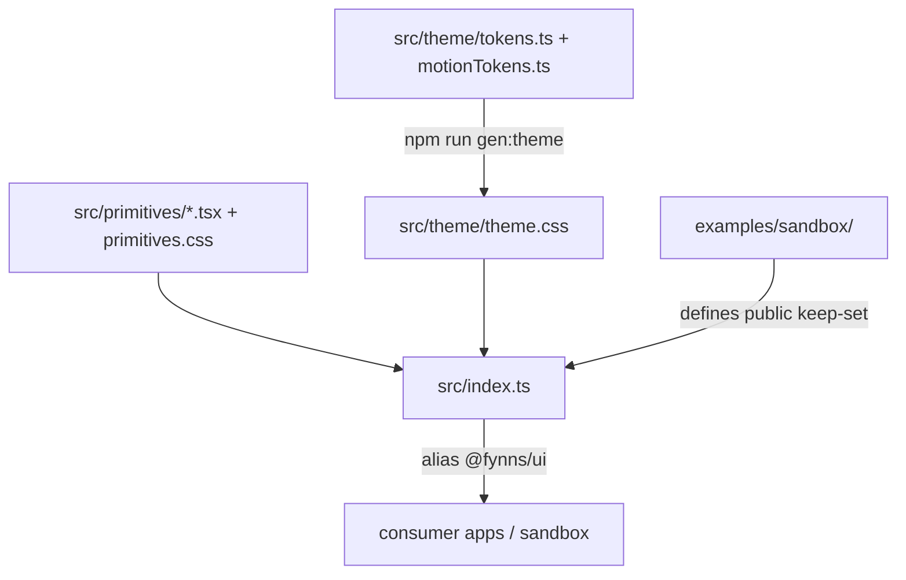

# Architecture overview

## Layers

| Layer | Path | Role |
|-------|------|------|
| Tokens | `src/theme/tokens.ts`, `motionTokens.ts` | Typed source of truth for `--fynns-*` |
| Generated CSS | `src/theme/theme.css` | Committed output of `gen:theme` |
| Primitives | `src/primitives/` | Self-developed React controls (`.fynns-*` classes), including `ControlStack` / `ControlRow` |
| Layout helpers | `src/layout/` | `measureOverflow` / `useOverflowBounds` (toolbar rhythm tokens: see AGENTS.md **Toolbar / unit rhythm**) |
| Public barrel | `src/index.ts` | Only keep-set exports (sandbox-demoed) |
| Consume tooling | `scripts/install-as-submodule.mjs`, `llm/` | Submodule + Vite/tsconfig wiring |
| Sandbox | `examples/sandbox/` | Globals inspector + Preview canvases |

## Elevation & theming

Surfaces climb `app-bg` → `surface-1` … `surface-5`. Dark is default; light via `applyFynnsThemeMode("light")` / `restoreFynnsThemeMode()`.

## Design rules (summary)

Full text: [`AGENTS.md`](../../AGENTS.md). Agents must:

- Style with `var(--fynns-*)` only; no hardcoded hex/rgba.
- No `@radix-ui/*` / `sonner`; no resurrected Toast / Popover / Panel /
  BlockingLoadingOverlay. Docked inspectors: app layout or `Drawer modal={false}`.
- Blocking / sectional busy → `BusyScrim` / `BusyRegion`; transient → `snackbar` + `SnackbarHost`.

## Source map

- `src/theme/tokens.ts`, `src/theme/motionTokens.ts`, `src/theme/theme.css`, `src/theme/themeMode.ts`
- `src/primitives/` (components + `primitives.css`)
- `src/layout/overflowBounds.ts`, `src/layout/useOverflowBounds.ts`
- `src/index.ts`
- `scripts/gen-theme.mjs`, `scripts/install-as-submodule.mjs`
- `examples/sandbox/src/pages/`
